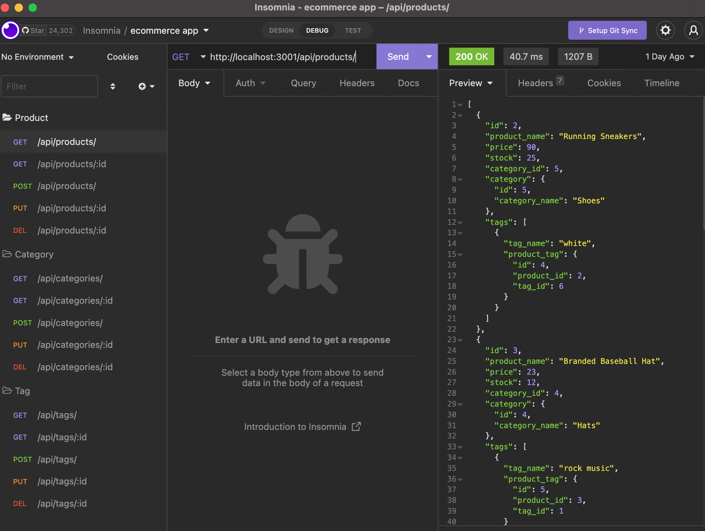

# ecommerce-app

## This app was created in order to help an ecommerce business owner easily access and update their online store's inventory. It allows for the business owner to minimize time spent handling inventory data. By working on this app, i was able to utilize mySQL, sequelize, javascript and practice utilizing Object-Relational Mapping (ORM).

## Links

- Repository: https://github.com/bburton5/ecommerce-app
- Walkthrough: https://drive.google.com/file/d/1o50Uzl4R8OplHRADXoC38UpzA07ppwVH/view

## Usage

## Credits

- StackOverflow
- MDN
- w3schools
- npm
